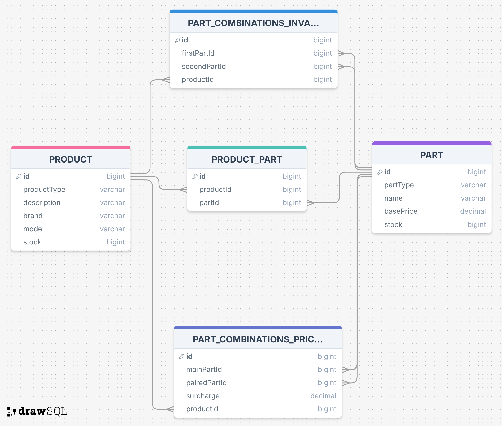

# bicycleShop
Codebase for bicycleShop project

Consists of 3 layers
- Persistence - Database layer
- Core - Operational logic layer
- Rest - REST endpoints (not implemented)
                              
### Requirements analysis.

> He also tells you that bicycles are his main product, but if the business continues to grow, he will surely start selling other sports-related items

Because of this I can design the system for 'Product' and 'Part' from the start.
Tables and classes can be extended later if specific logic appears per product.                                                                                

> Here is an incomplete list of all the parts

I will keep partType and productType enums so that I can limit the options. 
It says "incomplete" list but I would discuss over this to have it fixed because if it's a free text input, it would be very prone to errors.
Usually after having many products wording and case inconsistencies appear and data consistency and integrity is broken.
I have added constraints at the bottom of the SQL schema.

In case PRODUCT TYPES or PART TYPES need to be fully admin-editable, then we should introduce tables for them respectively.
Then when creating products or parts a type drop-down selection from these tables should be offered. And for editing the data in these tables separate UI in the admin panel
should be created. But I didn't went in this direction at this point.

For the part name I assumed that free string input is fine because at this point there will be no querying done based on this field.
       
> Some can be out of stock

This is a frontend specific thing. I will return the stock number and the UI can decide whether it needs to show "Out of stock" message 
or limit the quantity selection to the user to certain number. 
                   
> If you select "fat bike wheels," then the red rim color is unavailable because the manufacturer doesn't provide it.

This makes me think that some combinations are manufacturer specific. That means that if Bike model #1 can't support combination of "fat bike wheels" and "red rim color", 
Bike model #2 potentially could support such combination. Therefore, I will store combinations individually per product.

> These kinds of variations can always happen, and they might depend on any of the other choices, so Marcus asks you to consider this, as otherwise, he would be losing money.

I will store this as surcharge that will be added to the base price if needed. This kind of calculation should happen on the frontend as it will be much faster.
It doesn't make sense to call the backend on each reconfiguration on the Product UI. So I don't think that anything should be precalculated on the backend, but only nicely filtered data should be returned to frontend.


## 1. Data Model

I decided to use relational database.\
\
Schema: [sql-schema.sql](./bicycleShopPersistence/src/main/resources/sql-schema.sql)
\

#### Non-relational database opinion:
I have thought about using NoSQL database as price customizations and part validations can be easily stored in document format. But given 
that different models of bicycles may have same parts, colors I'm afraid lot of redundant data will be duplicated.


## 2. Main user actions
It's an e-commerce website with the following actions.\

Users with regular accounts can access classic e-commerce site website
1. Overview of products where we list all items from PRODUCT table
2. Open one product where its parts are fetched and customizations can be done.


## 3. Product page

Product page should do some calculations and validation on the frontend.
Data returned to page will be:
- Product information fetched from PRODUCT table
- Product parts list with JOIN with PRODUCT_PART and PART table
- Invalid part combinations from PART_COMBINATIONS_INVALIDITY based on the extracted set of
parts from previous step. With the set of invalid part combinations we can validate user selection on frontend and disable some options.
- Part combinations surcharges so that we can increase the price if the user selection of parts appears in PART_COMBINATIONS_PRICING as main and paired part.
Price increase will be calculated on the frontend.

## 4. Add to cart action
There should ber CART and CART_ITEMS tables created.

Something like\
CART(id, user_id, status, etc...)\
CART_ITEMS(id, cart_id, item_type, item_id, quantity, price, etc...)\
- cart_id is foreign key towards CART id.
- item_type is PRODUCT or PART. 
- Given that I store bicycles and parts in separate tables there should be no direct foreign key for the item_id
- price can be stored for historical purposes, otherwise for carts that are in progress price should be recalculated from
PARTS table.
\

We can reduce shown quantity for other users if there is item that's added in someone else's cart.\
To get quantity of product from active carts we'll use:
```
SELECT SUM(ci.quantity) AS total_quantity
FROM CART_ITEMS ci
JOIN CART c ON ci.cart_id = c.id
WHERE ci.item_id = 'some_product_id' AND c.status = 'ACTIVE';
```

After purchase cart status changes to COMPLETED and quantities of products and parts from the cart are subtracted from the 
PRODUCTS and PARTS tables.

## 5. Administrative workflows:
Marcus will have admin account and will be able to access Admin panel to edit products and parts.
1. Add new product page with the following options - SAVES TO PRODUCT TABLE
    1. Assign matching parts for the product - SAVES TO PRODUCT_PART TABLE
    2. Add invalid part combinations - SAVES TO PART_COMBINATIONS_INVALIDITY TABLE
    3. Add part combinations surcharges - SAVES TO PART_COMBINATIONS_PRICING TABLE
2. Add new part page. - SAVES TO PART TABLE
3. Other pages as overview of products, delete product (or deactivate it), etc...
            

### New product creation:
As stated in 5.1 Product page should be fairly extensive to allow the admin beside the 
basic product info, to add other information about impossible part combinations and additive surcharges.\
Beside this there should be option to assign some of the existing parts to the product.
Some quick form of adding a new part can be also integrated into the same page for better user experience. And such part can
be immediately assigned to the product.

### Adding a new part choice
As stated in 5.2 adding a new part can be separate page but also can be integrated into the new Product page.\
There are various options like:
- New Part page that creates the part but leaves it unassigned to product. Then the admin goes to the products and selects the 
new part as a possible options.
- New Part page that's more complex and beside creating the part also can show list of products with checkboxes so the admin can immediately assign it.
- Inside new Product page we can insert some quick form or overlay window to create parts that will be immediately assigned to that product.

### Setting prices
From the requirements it is evident that products do not have their own price but price is implicit from the selected parts.
In the admin panel there should be pages for:
- Edit part - where the admin can change the base price for the part. The base price is the price when part is not affected by other parts that increase the price.
- Special page where all part combinations are shown and can be edited. 
\

Please note that I added the product_id in the PART_COMBINATIONS_PRICING
table which allows specific customization of price per certain product. This way the admin can have full control, ex: matte color is 30, for Bike #1 with full suspension costs 40 but for Bike #2 with full suspension may cost 50.\
Same applies to PART_COMBINATIONS_INVALIDITY as well. If for Bike #1 you can't add "fat bike wheels" and "red rim color" because the manufacturer doesn't provide it, for Bike #2 the admin can allow this independently.


## Technical points

- Custom @Query definitions aren't always needed in Spring Data but I added them just to illustrate the ideas. Especially in 
the many-to-many relation here: [ProductRepository.java#L21](./bicycleShopPersistence/src/main/java/com/aleksandar/repository/ProductRepository.java#L21)